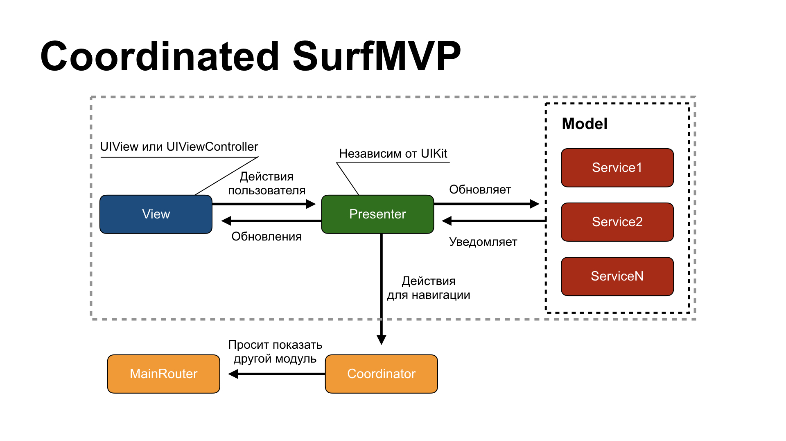
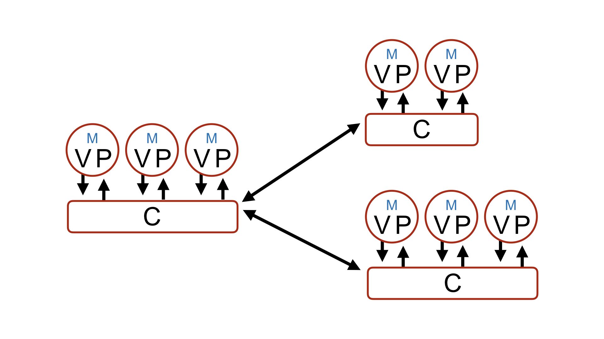

# **Coordinated Surf MVP**

## Содержание

## Предисловие

Этот архитектурный паттерн переродился из уже давно принятого за стандарт у нас в студии **SurfMVP**. Причиной появления новой надстройки над **SurfMVP** послужили проблемы с навгиацией в приложениях, которые начали разрастаться со временем, набирать массу сложных фич, реализация которых затруднялась при использование **routers**, которые мы ввели в **SurfMVP**. 

Из-за того, что навигация в приложение написанном на **SurfMVP** строится посредством обращение одного модуля через router к другому модулю. Схематично это выглядит следующим образом: 

Схема навигации в Surf MVP

**Coordinated Surf MVP** меняет концепт навигации в приложение, убирает акцент с отдельно существующих модулей объединяя их в группы модулей, выполняющих общие действия. 

## Описание архитектуры 

В основе архитектуры **Coordinated Surf MVP** лежит привычный для нас **Surf MVP**. Подробней можно прочитать [тут](Surf_MVP.md). 

Схема Coordinated Surf MVP – модуль

**Coordinated SurfMVP** – это архитектурный паттерн, в котором, в отличие от SurfMVP, мы убрали сущность Router, которая находилась внутри каждого отдельного модуля. Парадигма построения приложения немного изменилась. Модули теперь не являются полностью независимыми. Каждый модуль, за исключением полностью переиспользуемых, находится в отдельном обособленном UserFlow, который по задумке должен выполнять какое-то общее действие, приводящее пользователя к желаемому результату.

Например, набор экранов авторизации может является примером такого флоу. 

В Coordinated SurfMVP сущность Router заменила сущность [Coordinator](http://khanlou.com/2015/01/the-coordinator/), которая теперь отвечает за работу навигации не одного отдельного модуля, а набора модулей, которые связаны друг с другом логически. Это упрощает навигацию и работу с приложением. Схематично приложение будет выглядить так: 

Схема приложения с Coordinated Surf MVP

В самом верху стоит ApplicationCoordinator, который отвечает за первоначальный роутинг в приложении. К примеру, кейс, когда пользователь авторизован, тогда мы его отправим сразу в основную часть приложения, в противном случае, мы отправим его на экран авторизации.

Схематично навигация в приложение выглядит теперь таким образом. Каждый отдельный UserFlow обращается к собственному координатору, который уже в свою очередь решает, что будет происходить в дальнейшем. Ответственность по передачи данных и инициации дальнейшей навигации теперь лежит на координаторе, он уже связывается с другими модулями или другими координаторами, чтобы продолжить построение стека навигации.

Схема навигации в Coordinated Surf MVP

## Плюсы и минусы Coordinated SurfMVP

**Преимущества:**

1. Основной плюс подхода с координаторами — возможность переиспользовать целые блоки навигации внутри приложения. Теперь из любого места в приложении есть возможность вызвать этот координатор и не думать ни о чем, кроме как о завершении его работы.

2. Так как логика навигации обособлена внутри отдельного координатора, теперь гораздо удобней следить за навигацией: достаточно открыть один файл и вся картина перед глазами. Нет больше необходимости протыкивать все отдельные модули, чтобы понять, что за чем тянется, собирать приложение и смотреть в дизайн.

3. Удобнее проектировать в больших командах. Достаточно на этапе проектирования отдельной новой фичи выделить время на построение всей навигации и инициализации всех модулей, после чего делегировать разработку большому количеству разработчиков, и уже намного меньше будет возникать проблем с интеграцией этих экранов между друг другом.

   Для этого стоит первым делом инициализировать все модули и описать их ModuleOutput и ModuleInput. После чего можно полностью реализовать Coordinator, и связать все модули между собой. Данную задачу может выполить один человек. После этого этапа несколько разработчиков могут комфортно и качествнно параллельно разрабатывать несколько модулей.

4. Интеграция Deeplinks и Push-Notifications перестала быть головной болью.

**Недостатки:**

1. Большие координаторы – это больно. Из-за концентрации всей логики в одном месте становится гораздо сложнее не утонуть в большом количестве строк кода. Если не следить за соблюдением принципа единой ответственности, то конечно, координатор может вырасти в большого монстра, и все плюсы по читаемости кода легко испарятся.
2. Приходится много писать, чтобы достичь красоты в коде. Из-за большого количества слоев в приложении, каждый из которых отвечает за отдельное действие, приходится пробиваться через эти слои, чтобы дойти до желаемого координатора.
3. Memory Leaks – проблема не нова, но стоит следить за этим делом, чтобы не попасть в просак. Основная причина появления утечек памяти при работе с координаторами – это retain-циклы в коллбеках модулей. Так что нужно очень внимательно следить за сильными ссылками внутри замыканий.